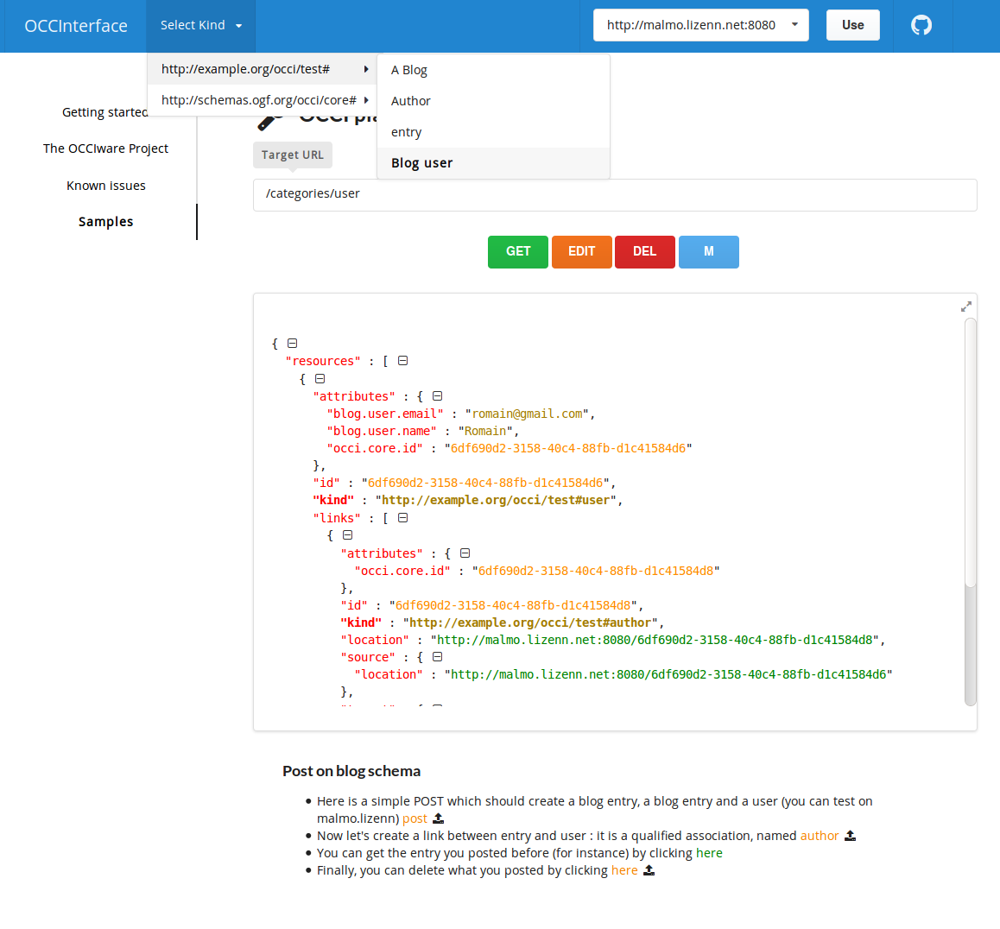

[](https://travis-ci.org/occiware/OCCInterface)
============
OCCInterface
============


OCCInterface is a generic application which let you explore and modify the resources of an OCCI server.
Its aims are multiple:
- give a productivity tool to developers calling the OCCI API
- manage and explore resources of an OCCI server easily
- vulgarize, explain OCCI to newcomers, diffuse the OCCI way of thinking

A demo is avalaible here : http://occinterface.herokuapp.com/



## How to use it

Requirement :
(some versions bellow should work too but have not been tested)
- nodeJS: >=6
- npm: >=3.8.9

NB. an easy way to install both, whatever the version of node you already have, is to install [nvm](https://github.com/creationix/nvm) :
``` bash
sudo apt-get update
sudo apt-get install build-essential libssl-dev
curl -o- https://raw.githubusercontent.com/creationix/nvm/v0.32.0/install.sh | bash
nvm install v6.2.0
```

Build and run :

``` bash
git clone https://github.com/occiware/OCCInterface.git
```

``` bash
npm install
```

``` bash
npm run dev
```

You can go to [http://localhost:3000/](http://localhost:3000/).

Then, you need to enter the URL of the OCCI server on the input at the top of the page (without "/" at the end)

## How to integrate it in your own OCCI implementation
TODO

## FAQ

- What is a **playground link** and how to create it ?  
A playground link is a clickable link that make a GET request on the API and displays its content in the codeview.
To do so, create a classic link in markdown, and make your URL begin with "/"  
example:  
```
[/resources/compute](/resources/compute)
```

- What is a **sample link** and how to create it ?  
A sample link is a link that post datas onto the current server when clicking on it. The formating is as follow (in markdown):

``` JSON
text before %{
  "text": "sampleLink",
  "post": {
    "adress": "/categories/compute",
    "datas": {
      "attributes": {
        "occi.compute.hostname" : "test",
        "occi.compute.state" : "inactive"
      },
      "id": "6df690d2-3158-40c4-88fb-d1c41584d6e5"
    }
  }
}% text after
```

It will result into a clickable link, which post datas on click:

``` HTML
<p>text before <a>sampleLink</a> text after</p>
```
You can post an array instead of an object (in the "datas" attribute).
If you want your sample link to post to different categories, just put an array instead of an object inside the "post" attribute. Example :

``` JSON
%{
  "text": "sampleLink",
  "post": [
    {
        "adress": "/categories/compute",
        "datas": {
          "attributes": {
            "occi.compute.hostname" : "test",
            "occi.compute.state" : "inactive"
          },
          "id": "6df690d2-3158-40c4-88fb-d1c41584d6e5"
        }
    },
    {
        "adress": "/categories/storage",
        "datas": [
            {
              "attributes": {
                "occi.storage.size" : 1000
              },
              "id": "6df690d2-3158-40c4-88fb-d1c41584d6e6"
            },
            {
              "attributes": {
                "occi.storage.size" : 500
              },
              "id": "6df690d2-3158-40c4-88fb-d1c41584d689"
            }
        ]
    }
  ]
}%
```


- Can I delete datas with a sample link ?  
Yes, you can, with the following format :

``` JSON
%{
  "text": "my sample link",
  "del": "/6df690d2-3158-40c4-88fb-d1c41584d6e7"
}%
```

- How to deploy on Heroku ?  

``` bash
#need to be done once
heroku git:remote -a herokiRepo
```
``` bash
npm run build
```
``` bash
git commit -am "deployment message"
```
``` bash
git push heroku master
```
- I have an issue "(mixed active content)", how to fix it ?
You need to have the same domain policy between your OCCI server and your OCCInterface server. For instance http with http, or https with https.


## How to configure your Erocci Server
(TODO temporarly here, remove later)

Follow the instructions of [erocci](https://github.com/erocci/erocci/blob/master/doc/README.md)

Then, you need to edit the config/sys.config file.
Find the "backend" section, and modify it that way :

``` erlang
{backends,
    [
     {root, erocci_backend_mnesia,
      [{schema, "/path/to/config.xml"}],
      <<"/">>}
    ]
   }
```

Copy locally and use [this file](https://github.com/occiware/occi-schemas/blob/master/schemas/http%253A%252F%252Fschemas.ogf.org%252Focci%252Finfrastructure%2523.xml) as the config.xml file.

Then, you can start the server with

``` bash
./start.sh
```
